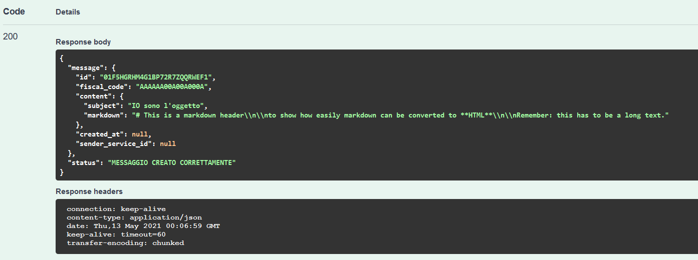

# PagoPA Client

Questo repository contiene un client che implemeta l'invocazione delle IO API con l'obbiettivo di simulare l'invio di un messaggio a un cittadino italiano. 

**Versione:** 1.0.0
**Data rilascio:** 13/04/2020

## Utilizzo WEB

Una volta clonato il repository posizionarsi sulla root e lanciare il seguente comando da terminale:

> mvnw spring-boot:run
 
Attendere l'avvio, dopodiché navigare su **http://localhost:9080/swagger-ui.html** ed interaggire con i pulsanti **Try it out** prima e **Execute** poi.
Dopo tali passaggi sarà possibile visornare la response restituita dal sistema con l'avviso di avvenuto invio del messaggio.

## Utilizzo da Terminale

Una volta clonato il repository posizionarsi sulla root e lanciare il seguente comando da terminale:

> mvnw spring-boot:run
 
Attendere l'avvio, dopodiché aprire un'altra finestra del terminale e lanciare il successivo comando:

> curl -X POST "http://localhost:9080/api/v1/message/submit"
 
e attendere la risposta positiva dal sistema